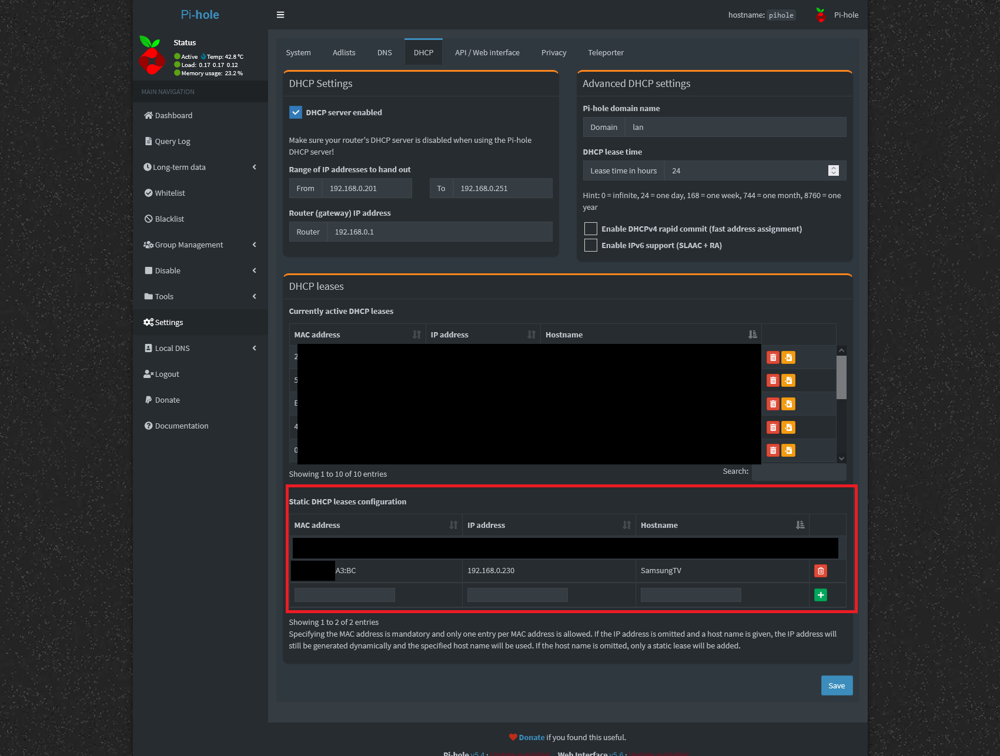
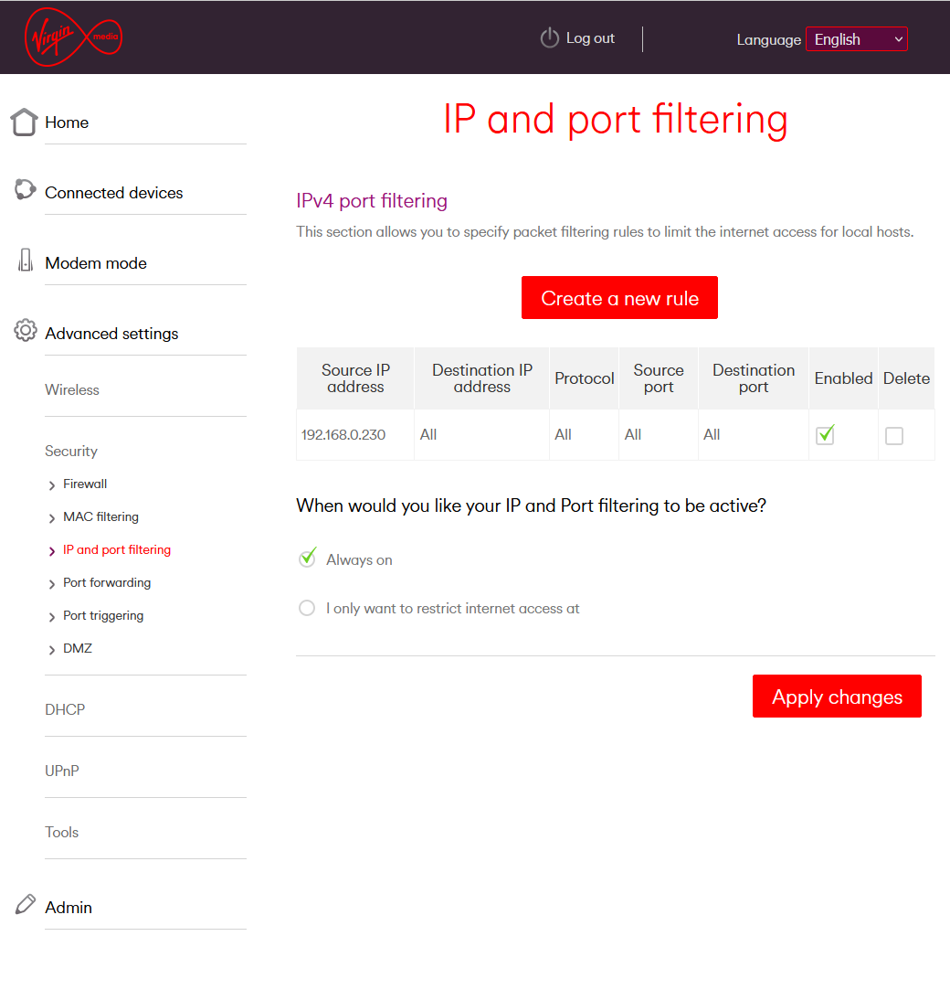

I recently purchased a shiny new 4K Samsung TV. It's brilliant, but it's nearly impossible to buy one without 'smart' capabilities (e.g. Google Home, Alexa, Bixby, etc). There's <a href="https://www.kaspersky.co.uk/resource-center/threats/is-your-smart-tv-spying-on-you" target="_blank">plenty of security reasons why Smart TVs are bad</a>.

This post is how to make it a bit dumber (but not brain dead!). I like that I can use my TV for streaming movies over the local network, but I don't care for having apps running on it (Netflix works just fine on the PS5 thanks!), so I wanted to block all outbound internet activity for it.

In the end, this was quite simple. First, I ensured that the TV was assigned a static IP address. The easiest way for me to do this was from <a href="https://pi-hole.net/" target="_blank">Pi-hole</a> that I use as a DHCP server, and then assigned a static DHCP lease:

*Notice the IP address I set that will always be assigned to the MAC address (of the TV).*

Then in my router configuration I configured IPv4 port filtering to block all internet traffic. This is what it looks like on my Virgin Hub 3:

The TV now has no in/outbound traffic, but it can still talk to the local network to serve up media. Perfect!