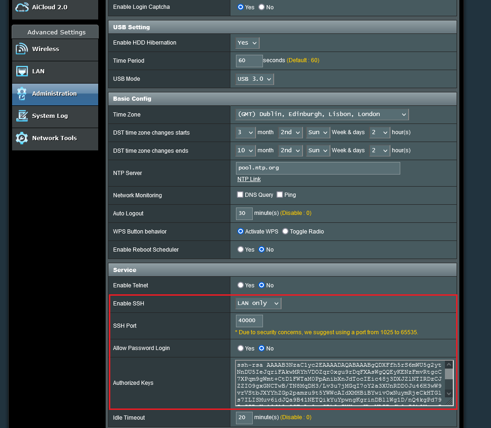
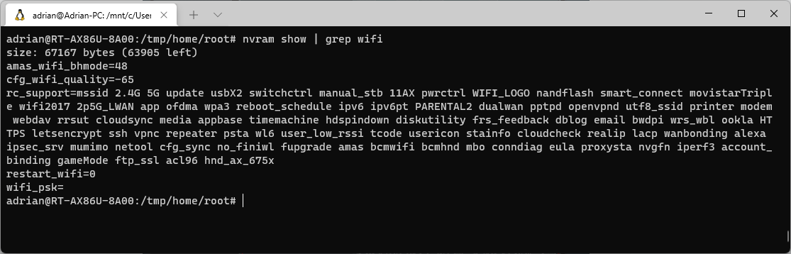

Asus routers let you SSH in to them for remote management. In this post you'll learn how to write an ash shell script in flash memory to stop an external hard disk from sleeping.

I had a problem where a new external disk I had attached to my router (that I used as a DLNA server) kept going to sleep. This reset playback on my TV if paused for more than a couple of minutes, so I wanted to keep the disk awake. It turns out this is possible by SSH'ing in to the router, writing a script to flash memory, and configuring it to run when a USB device is connected.

First, navigate to your router admin page, go to the Administration Settings and enable login via SSH. It will look something like this:


Then SSH in to it. The router is running BusyBox [1] which is a very lightweight Linux executable used for embedded systems. It gives you some very basic utilities (sorry, don't even expect nano!).

The filesystem is running in RAM, which obviously resets on reboot. However, if we write to the `/jffs` path, it will be written to flash memory - this is perfect to persist a script that could run on boot.  BusyBox uses Almquist shell, so we need to write any scripts prefixed with the ash shell shebang.

There is one problem, if this is the only area we can persist data, how do we run a script on boot? Well, we can write to NVRAM (non-volatile RAM). NVRAM is storing a ton of data about your router, such as your WiFi password, public SSH keys, SSID, etc. but we can use it to set a small command that runs when a USB device is mounted [2].  

Here are some of the WiFi settings if you grep the `nvram show` command:


The magic parameter we want to set is `script_usbmount` to run a command when a USB device is mounted.

So, putting it altogether, this is what it would look like:
```bash
cd /jffs # Change directory to flash memory
echo "#!/bin/ash" >> ./insomnia.sh # Append the ash shell shebang to .insomnia.sh in flash memory
echo 'while :; do echo $(date) > /mnt/8TB/.insomnia; sleep 90; done' >> ./insomnia.sh # append command
chmod +x ./insomnia.sh # make the script executable
nvram set script_usbmount="ash /jffs/insomnia.sh" # set the parameter to execute when a USB device is mounted
nvram commit # commit the parameter to non-volatile memory
service reboot # reboot the router
```

I'm using echo with output redirection to write to a file called `insomnia.sh`. As I'm terrible with VIM (which is also available) this works well enough for me, but feel free to use Vim if you're comfortable with it. All it is doing is writing the date & time to the `.insomnia` file on the external disk `/mnt/8TB` and sleeping for 90 seconds (it sleeps after around 2 minutes), and loops indefinitely.

That's it! The disk will now never sleep. I intend to make this script a little smarter so that it sleeps overnight when it's not actually in use.. I'll update this post when I do.

Sources:
1. https://www.snbforums.com/threads/how-to-run-cron-and-other-scripts-on-startup.69063/#post-648945
2. https://www.busybox.net/downloads/BusyBox.html