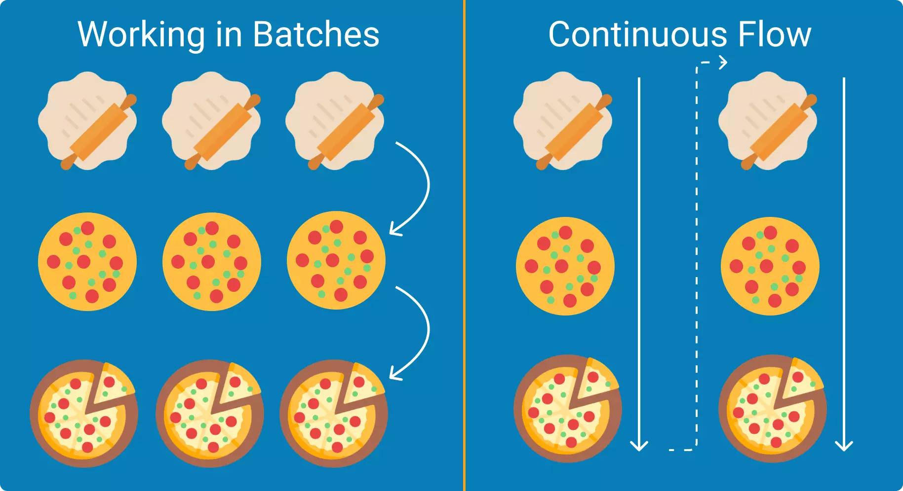

When writing software, it's important to understand who it is for and what it will achieve. Ensuring the ticket is clear and understood by those around us ensures we don't waste precious time. My favourite approach to this is focusing on the end user from the frontend, and working towards the backend.

Occasionally I'll see a ticket like this:
> Write an API endpoint that does X thing to the database, it should return a 200 if ok otherwise 400

The biggest problem is it lacks context. Why are we doing this? Who is it for? What should it look like? How do I know if I've finished it?

The problem is a bit like declarative vs imperative programming: describing the desired state for what we want vs how to implement it. I see the following as the core parts of a ticket to make it 'declarative':
- The User Story
    - `As a receptionist, I want to compose emails, so that I can make appointments with customers`
    - It has 3 parts: the actor, the narrative and the goal
    - It sets the context and describes the requirement
- Acceptance Criteria
    - A bullet pointed list that you could prefix with "done when" to describe the behaviour, not the implementation
    - e.g.: _Done When_
        - `A recipient email address can be specified`
        - `A subject can be specified`
        - `A message body can be specified`
        - `The email is sent to the recipient`
    - _You may also notice that each of these bullet points can be copied verbatim and used for a UI test!_
- Optional but recommended: Wireframes to describe roughly what the UX could look and feel like, or to describe the user's workflow. Pictures speak 1000 words, but there's a fine line to walk in order to not dictate implementation detail. Use wireframes to describe the goal and not the solution. They enable collaboration with everyone: developers, designers, product, users and stakeholders
- Optional: Supporting links, architectural diagrams, prior art / investigations.

The above doesn't describe exactly how it should be implemented, just what the expected outcomes are. This provides flexibility and allows you to have conversations to arrive at the best solution, and make those decisions as late as possible (perhaps after further research).

If your team is responsible for different areas of development (e.g. frontend, backend) then you can then make the ticket more granular for those specific tasks.

Now, everyone has the context, the shared goal and knows when they can say the goal is accomplished. At minimum it's clear what the ticket actually means and what needs to be achieved.

By writing tickets this way it enables you to deliver cohesive features continuously, rather than in batches to your users.

|  | 
|:--:| 
| Source: [Kanbanize.com](https://kanbanize.com/continuous-flow) |

# Further Reading
1. Writing user stories: https://www.gov.uk/service-manual/agile-delivery/writing-user-stories
1. Writing acceptance criteria: https://technology.blog.gov.uk/2015/03/04/creating-better-acceptance-criteria-for-user-stories/
1. Wireframing with Balsamiq: https://balsamiq.com/tutorials/articles/firstwireframe
